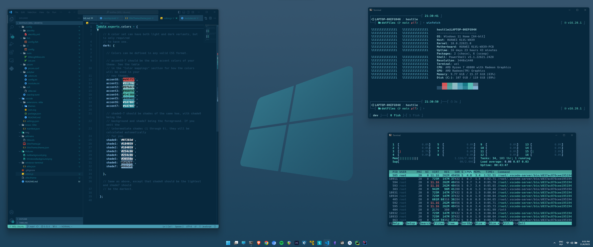
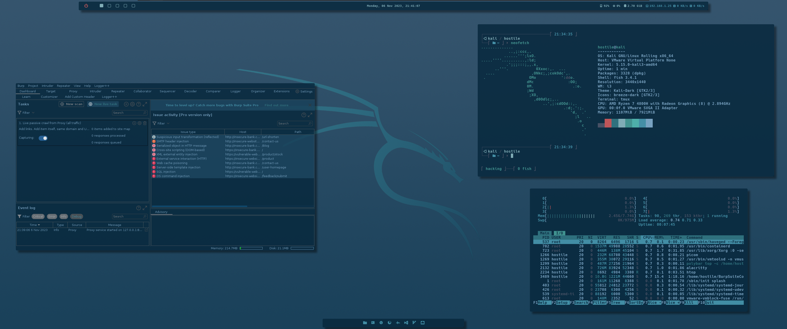

# dotfiles

Dotfiles for Windows (and WSL) and Linux.

*Windows*

*Kali Linux*

## Supported software

**Terminals**
- alacritty
- windows terminal

**Desktop environments**
- i3
- picom
- polybar
- rofi

**IDE**
- vscode
- nvim

**Shell**
- fish
- starship

created with [themer.dev](https://github.com/themerdev/themer)