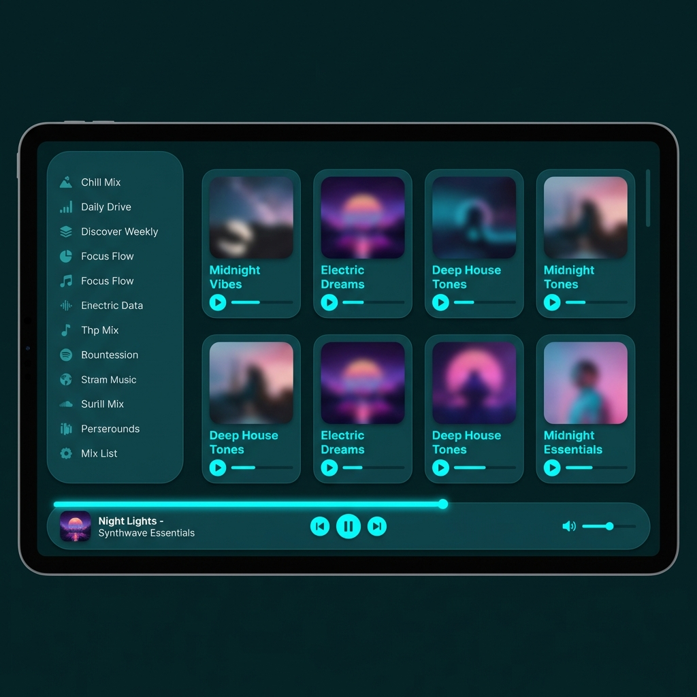

# Hostile Theme for Spotify

A dark, teal-themed Spotify theme matching the Hostile color scheme used in JetBrains IDEs and Burp Suite.



## Color Scheme

- **Background**: `#042024` (Deep teal-black)
- **Text**: `#52b5b7` (Teal)
- **Primary Accent**: `#30f3d9` (Bright cyan)
- **Secondary Accent**: `#69ddce` (Soft mint green)
- **Selection**: `#0e3a40` (Dark teal)
- **Error/Heart**: `#ff5c8a` (Pink)

## Features

- ✨ Smooth transitions and hover effects
- 🎯 Consistent rounded corners (7px)
- 💫 Glow effects on interactive elements
- 🎨 Custom scrollbars matching the theme
- 🎭 Enhanced cards with subtle shadows
- 🎵 Styled progress bars and volume controls
- 🔍 Improved focus states for accessibility
- 🚫 **No gray backgrounds** - All gray elements replaced with teal/cyan theme colors

## Prerequisites

You need to have [Spicetify](https://spicetify.app/) installed on your system.

### Install Spicetify

**macOS/Linux:**
```bash
curl -fsSL https://raw.githubusercontent.com/spicetify/spicetify-cli/master/install.sh | sh
```

**Windows (PowerShell):**
```powershell
iwr -useb https://raw.githubusercontent.com/spicetify/spicetify-cli/master/install.ps1 | iex
```

## Installation

### Automatic Installation (Recommended)

1. Clone or download this repository
2. Run the installation script:

```bash
# From the dotfiles directory
./Spicetify/install.sh
```

### Manual Installation

1. **Find your Spicetify themes directory:**
   ```bash
   spicetify config-dir
   ```
   
   This will show you the config directory. Themes are in `[config-dir]/Themes/`

2. **Copy the theme:**
   ```bash
   # macOS/Linux
   cp -r Spicetify/Hostile ~/.config/spicetify/Themes/
   
   # Windows
   # Copy the Hostile folder to: %APPDATA%\spicetify\Themes\
   ```

3. **Apply the theme:**
   ```bash
   # Set the theme and color scheme
   spicetify config current_theme Hostile
   spicetify config color_scheme hostile
   
   # Apply the changes
   spicetify apply
   ```

## Updating

If you make changes to the theme files, run:

```bash
spicetify apply
```

To force a full update:

```bash
spicetify backup
spicetify restore
spicetify apply
```

## Customization

### Modifying Colors

Edit `color.ini` to change colors. Each color is defined in hex format (without the `#`).

After making changes, run:
```bash
spicetify apply
```

### Modifying Styles

Edit `user.css` to change the appearance of UI elements. This file uses standard CSS.

Important CSS variables:
- `--border-radius`: Controls roundness of corners (default: 7px)
- `--transition-duration`: Animation speed (default: 0.2s)
- `--overlay-opacity`: Transparency of overlays (default: 0.95)

## Troubleshooting

### Theme not applying?

1. Make sure Spotify is closed
2. Run:
   ```bash
   spicetify backup apply
   ```

### Spotify updated and theme broke?

Run these commands:
```bash
spicetify backup apply
```

If that doesn't work:
```bash
spicetify restore backup apply
```

### Colors look wrong?

Check that you're using the `hostile` color scheme:
```bash
spicetify config color_scheme hostile
spicetify apply
```

## Uninstallation

To remove the theme and restore Spotify to default:

```bash
spicetify restore
```

## Screenshots

TODO: Add screenshots showing:
- Main library view
- Now Playing screen
- Playlist view
- Artist page
- Search interface

## Credits

- Theme created by Igor Wojciechowski
- Based on the Hostile color palette
- Built for [Spicetify](https://spicetify.app/)

## License

MIT License - Feel free to modify and share!
